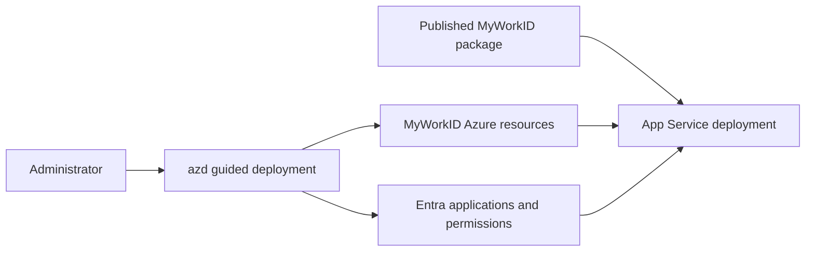

# Deploy MyWorkID with Azure Developer CLI

Deploy [MyWorkID](https://www.glueckkanja.com/en/security/my-work-id/) to Azure and prepare its Microsoft Entra application objects through a guided `azd` experience.

This template helps an administrator:

- provision the MyWorkID Azure resources with Bicep;
- create or update the required Microsoft Entra application objects;
- deploy a published MyWorkID package without local build tooling;
- configure authentication contexts, branding, Verified ID, TAP, and custom domains;
- rerun DNS and certificate validation safely when propagation takes time.

> This deployment changes Azure resources and Microsoft Entra application objects. Review the requested permissions and authentication-context values before deployment. Conditional Access, DNS, and optional Verified ID setup still require tenant-specific administrator review.

## Quickstart

Install [Azure Developer CLI](https://learn.microsoft.com/azure/developer/azure-developer-cli/install-azd) 1.23.7 or later. Use an account that can deploy the target Azure resources and create the required Entra objects.

From a new empty directory, run:

```powershell
azd init -t nathanmcnulty/azd-myworkid && azd up
```

The default `releaseZip` flow downloads the published MyWorkID package. Administrators do not need the .NET SDK, Node.js, or npm. Normal cached or browser authentication is used for Azure and Microsoft Entra.

## What gets deployed



The template uses `azd` and Bicep for Azure, lifecycle hooks for Entra configuration, and App Service for the application. The default release package comes from the upstream MyWorkID GitHub release; `sourceBuild` is an optional contributor workflow.

## Administrator choices

| Choice | Default | When to change it |
| --- | --- | --- |
| Deployment mode | `releaseZip` | Use `sourceBuild` only when intentionally building checked-in source |
| Release version | Latest published package | Pin a reviewed version for repeatable production deployment |
| Authentication contexts | `c50`, `c51`, `c52` | Replace with the tenant's real context IDs before production use |
| Custom domain | None | Enable after the required DNS records can be created |
| Managed certificate | Enabled for a configured subdomain | Disable when TLS is managed externally |
| Reduced-permission flags | Disabled | Use only after reviewing the functionality skipped by each flag |

See the [configuration reference](docs/configuration.md) before changing these values.

## Verify and finish

After `azd up`:

1. Confirm the App Service and supporting Azure resources are healthy.
2. Review the exact Entra application objects and permissions created or updated.
3. Replace the sample authentication-context IDs before enabling their user journeys.
4. Complete the [tenant-specific next steps](next-steps.md), including Conditional Access and optional Verified ID secrets.
5. If a custom domain is waiting for DNS or HTTPS propagation, correct the records and rerun `azd up`.

## Documentation

| Guide | Use it for |
| --- | --- |
| [Architecture](docs/architecture.md) | Components, deployment modes, and trust boundaries |
| [Configuration](docs/configuration.md) | Deployment mode, permissions, domains, certificates, and reruns |
| [Operations](docs/operations.md) | Verification, DNS completion, troubleshooting, and cleanup |
| [Development](docs/development.md) | Source builds and contributor prerequisites |
| [Agent-assisted deployment](docs/agent-assisted-deployment.md) | Safe administrator and agent authority boundaries |
| [Tenant next steps](next-steps.md) | Conditional Access, authentication contexts, domains, and Verified ID |

## Cleanup

Remove the Azure deployment with:

```powershell
azd down --purge
```

Tenant application objects, Conditional Access policies, externally managed DNS, and other tenant configuration are not implicitly removed. Review the exact objects and follow [operations](docs/operations.md#cleanup) before deleting tenant state.

This template packages an upstream product. Review the [MyWorkID documentation](https://github.com/glueckkanja/MyWorkID/wiki/Installation) and its licensing/support terms before production use.
